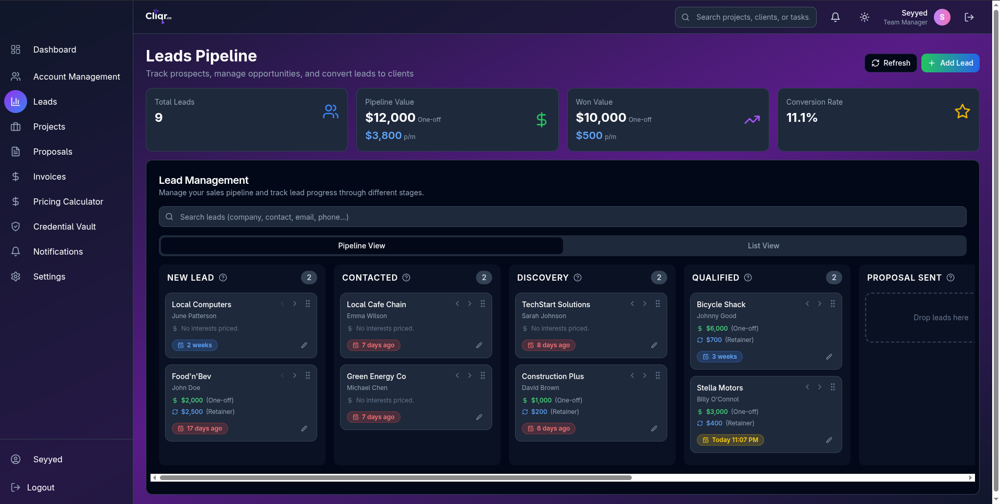

<!-- Project Logo -->
<p align="center">
  
</p>

<h1 align="center">Cliqr.co</h1>

<p align="center">
  <b>Modern CRM, Invoicing, and Team Management Platform</b><br/>
  <a href="https://github.com/Ozwebnet/cliqr.co/actions"></a>
  <a href="https://github.com/Ozwebnet/cliqr.co/issues"></a>
  <a href="https://github.com/Ozwebnet/cliqr.co/blob/master/LICENSE"></a>
</p>

---

## 🚀 Overview
Cliqr.co is a modern, all-in-one platform for CRM, invoicing, and team management. Built with a focus on productivity, collaboration, and ease of use.

## ✨ Features
- 🧑‍💼 Customer Relationship Management (CRM)
- 💸 Invoicing & Payments
- 👥 Team & User Management
- 📊 Dashboards & Analytics
- 🔔 Notifications & Reminders
- 🔒 Secure Credential Vault
- ⚡ Fast, modern UI (React + Tailwind CSS)
- ...and more!

## 🖥️ Screenshots
<p align="center">
  
</p>

## 🛠️ Tech Stack
- React
- Tailwind CSS
- Supabase
- Vite
- Node.js

## 🏁 Getting Started

1. **Clone the repo:**
   ```bash
   git clone https://github.com/Ozwebnet/cliqr.co.git
   cd cliqr.co
   ```
2. **Install dependencies:**
   ```bash
   npm install
   ```
3. **Start the dev server:**
   ```bash
   npm run dev
   ```

## 🤝 Contributing
Contributions are welcome! Please open issues or submit pull requests for improvements and bug fixes.

## 📄 License
This project is licensed under the MIT License. See [LICENSE](LICENSE) for details.

## 📬 Contact
For questions or support, open an issue or contact the maintainer at [ozwebnet@gmail.com](mailto:ozwebnet@gmail.com). 